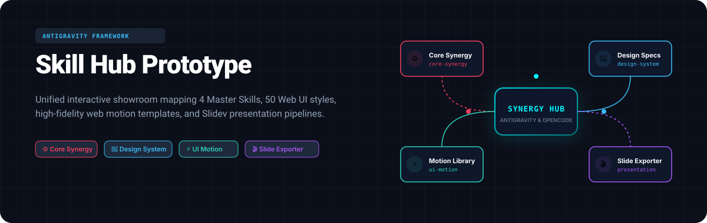

<p align="center">
  
</p>

# Antigravity Skill Hub

> **四大核心技能與工程協同體系的互動式展現平台。**
> 
> 這是一個基於 Google Antigravity 框架所建構的展示門戶（Showroom），旨在提供 Prompt 工程師與 UI/UX 開發者一個直觀的互動式藍圖，快速預覽、複製與調試 4 大 Master Skills 的核心規則與視覺風格。

---

## 🚀 專案展示 (Live Portal)

本專案提供高保真互動式儀表板（Prototype Portal），已託管於 GitHub Pages。您可以直接點擊下方連結體驗：

👉 [**Antigravity Skill Hub Live 展示館**](https://tinyu070226-stack.github.io/antigravity-skill-hub/)

*包含 50 種設計風格 Spec 的色票卡展示、前端動效微交互、以及場景切換與提示詞複製系統。*

---

## 🛠️ 四大 Master Skills 核心架構

本平台整合並呈現以下四個核心技能模組的原理與實作資源：

### 1. ⚙️ 底層協同與工程門禁全集 (`core-synergy-skill`)
* **核心價值**：定義 Antigravity 與 OpenCode 雙 Agent 協同的架構門禁。
* **主要機制**：`grill-with-docs` 智慧詢問模型、`kb-retriever` 漸進式檢索與自動化代碼二方審查，守護代碼正確性。

### 2. 🎨 視覺美學與反 Slop 全集 (`design-system-skill`)
* **核心價值**：對抗 AI 模板化（Slop）平庸設計，建立精確視覺指標。
* **主要機制**：精選 50 種經典與現代網頁設計風格（如 Neo-Brutalism、Swiss Grid、Japanese Editorial、OLED Bento 等）與品牌色票配方。

### 3. ⚡ 前端動效與向量動畫全集 (`ui-motion-skill`)
* **核心價值**：引導高品質、具備物理真實感且不生硬的 UI 微動效。
* **主要機制**：Stagger 交錯動畫、基於 `prefers-reduced-motion` 的無障礙動效，以及對齊 Apple/Stripe 等大廠的網頁動效。

### 4. 🎬 簡報大腦裝配流水線 (`presentation-skill`)
* **核心價值**：自動化 16:9 與 A4 比例的 Slidev 與 PPT 簡報排版。
* **主要機制**：三大場景提示詞模板（標準製作、同風格極速換內容、換風格換內容），搭配 Python 物理防跑版字級自動縮放引擎。

---

## 📁 專案目錄結構 (Workspace Directory)

```text
├── .agents/                    # Customizations 與協同開發協議規則
│   ├── AGENTS.md               # 專案 Agent 核心協同鐵律（TDD、角色解耦）
│   └── skills/                 # 本地安裝之 Custom Agent Skills
│       ├── beautify-github-readme/
│       └── mengto-animation-systems/
├── assets/                     # 專案視覺資源 (如 README Hero banner)
├── docs/                       # 前端靜態網頁（GitHub Pages 部署目錄）
│   ├── index.html              # 互動式門戶主頁
│   ├── app.js                  # 核心渲染與複製控制邏輯
│   └── skills_data.json        # 4 大 Master Skills 的結構化 JSON 資料庫
└── skill_hub_prototype/        # 本地原型開發目錄
```

---

## ⚡ 快速開始與使用方式

### 1. 本地啟動展示館
本專案為純前端無狀態（Stateless）架構。您只需下載專案並直接在瀏覽器中開啟 `docs/index.html` 即可。

### 2. 獲取設計風格或複製 Master Prompt
1. 開啟首頁後，點擊任一 Master Skill 卡片（例如 **`presentation-skill`**）。
2. 在詳情頁中，您可以點擊選單按鈕（📌 標準、🔄 同風格、🎨 換風格）切換不同的簡報場景。
3. 點擊右上角的 **📋** 圖示，系統會觸發綠色水波紋反饋動畫與頂部 Toast 提示，代表您已成功複製完整的 Master Prompt。
4. 將複製的 Prompt 餵給您的 Agent 大腦，即可開始進行無跑版、圖文並茂的簡報生成。

---

## 🛡️ 專案防禦與協作鐵律 (AGENTS.md)

為了確保項目在多 Agent 協同開發時不致崩潰，本專案在 [`.agents/AGENTS.md`](./.agents/AGENTS.md) 中定義了嚴格的物理防線：

1. **嚴禁使用子字串比對進行語意/函數存在性檢查**：必須使用精確正則表達式，嚴禁寫出 `if "showToast" not in content` 這種假陰性 Anti-pattern。
2. **斷言先行 (TDD) 與機械化驗收**：代碼撰寫前，必須在 `scratch/` 下定義 `expected_behavior.json` 並使用 Playwright 執行測試。
3. **多 Agent 角色解耦 (Decoupled Loop)**：Planner（設計規劃）、Coder Subagent（代碼實作）與 QA/OpenCode（編譯及 Console 監聽）必須三權分立，杜絕 Context 污染與幻覺循環。

---

## ⚖️ 授權條款 (License)

本專案採用 **MIT License** 授權開源。
